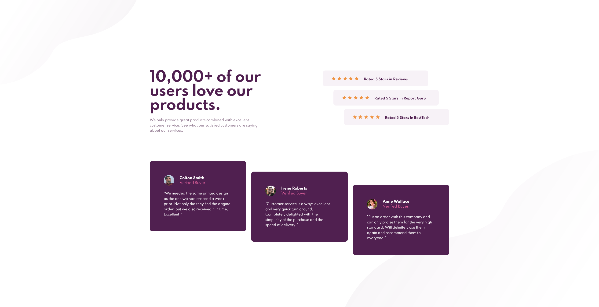

# Frontend Mentor - Social proof section solution

This is a solution to the [Social proof section challenge on Frontend Mentor](https://www.frontendmentor.io/challenges/social-proof-section-6e0qTv_bA). Frontend Mentor challenges help you improve your coding skills by building realistic projects. 

## Table of contents

- [Overview](#overview)
  - [The challenge](#the-challenge)
  - [Screenshot](#screenshot)
  - [Links](#links)
  - [Built with](#built-with)
  - [What I learned](#what-i-learned)
- [Author](#author)

## Overview

### The challenge

Users should be able to:

- View the optimal layout for the section depending on their device's screen size

### Screenshot

### Links

- Solution URL: [https://github.com/CarlHumm/social-proof-frontendmentor]
- Live Site URL: [https://carlhumm.github.io/social-proof-frontendmentor/]

### Built with

- HTML
- CSS
- Flexbox

### What I learned

I should take more time to think about how the design will flow at different sizes and where to include media queries rather than relying on estimates and best guesses. Turned into abit of a hacky mess despite being a simple layout as I found myself adjusting/overwriting smaller viewport styles after writing the styles for the next breakpoint.

Lesson learnt, save time and make it more manageable and maintainable by tackling it in a sequential manner, not getting ahead of yourself and being sure to check styles before moving onto the next major block.

## Author
- Frontend Mentor - [https://www.frontendmentor.io/profile/CarlHumm]

